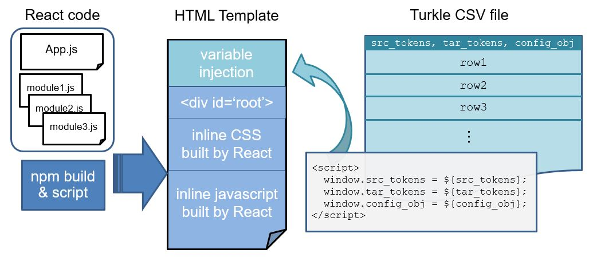

# TASA - Translation And Structural Alignment (v1.1.4pre)

TASA is a [React](https://reactjs.org) web application for translating
and aligning sentence pairs.

## Prerequisites

TASA is built using [Node.js](https://nodejs.org/en/) and the Node
Package Manager, [npm](https://docs.npmjs.com).

Once you have Node and npm installed, go to the `webapp/` directory
and run the command:

    npm install

This will download the dependencies specified in
[webapp/package.json](webapp/package.json) to the
`webapp/node_modules/` directory.

## Building

From the `webapp/` directory, generate the TASA HTML templates using
the command:

    npm run buildTemplates

This will create a React web application in the `webapp/build/`
directory, and generate the HTML templates
`webapp/anno-app-{turkle|mturk}.html`.

## Using TASA with Turkle or Mechanical Turk

The repo contains scripts for creating Turk-compatible HTML templates
for the React web application.  Neither Mechanical Turk nor
[Turkle](https://github.com/hltcoe/turkle) allow users to upload
static CSS or JS files for an HTML template.  All of the CSS and JS
files required by a Turk template must either be inserted into the
HTML template file or published on public CDNs.

TASA has separate scripts for generating
Mechanical Turk and Turkle templates.  Both scripts insert the
React JavaScript files into the HTML template.

- The [webapp/make-turkle-template.sh](webapp/make-turkle-template.sh)
  script copies built CSS and JS bundles into the HTML template
  [webapp/anno-app-turkle.html](webapp/anno-app-turkle.html).

- The [webapp/make-mturk-template.sh](webapp/make-mturk-template.sh)
  script copies built CSS and JS bundles into the HTML template
  [webapp/anno-app-mturk.html](webapp/anno-app-mturk.html).
  Note that the Mechanical Turk website has a size limit for HTML
  templates, this script simply copies the CSS and JS contents into 
  HTML templates. If current HTML template file exceeds the size limit, 
  upload the CSS and JS files generated by `npm build` to a CDN, 
  and link their URLs in the HTML template file to reduce the size of 
  template.

Before running TASA on Turkle, adjust the HTML template size limit
by editing this setting in `turkle_site/settings.py` on local install.

```python
# max size of template in KB
TURKLE_TEMPLATE_LIMIT = 1024 # default is 64. change it to 1024
```
Also please read this [document](https://github.com/hltcoe/turkle/blob/master/docs/TEMPLATE-GUIDE.md) 
about how the Turkle template variables work for your first time working with Turkle.

## Running TASA independently

You may run TASA on your local machine in developement using the command:

    npm start

This command will open up a development server on port 3000. You may edit the 
React code and simultaneously see how the UI changes. It is useful when you want
to develop new feature, as you don't need to load the template into Turkle for 
every change you made. In this mode, TASA uses the sentence pair and configuration
data stored in `webapp/src/mock.json` as input and renders the UI accordingly.


### CSV format for Turk templates

The Turk HTML templates are designed to work with a CSV file with the
fields:

- `src_tokens` - A JSON array of token strings
- `tar_tokens` - A JSON array of token strings
- `config_obj` - A JSON object with the optional parameters:

  - `alignment` [boolean matrix]: Optional initial alignments.
    An array with `src_tokens.length` subarrays, where each subarray
    has `tar_tokens.length` boolean values.
  - `collect_comment` [boolean]: Whether or not the "Comment" box is
    displayed.  Adding this attribute to `config_obj` will cause the
    `additionalData` column to be added to the output CSV file.  The
    column contains a JSON object.  The comment text (if non-empty) 
    will be stored in the `comment` field of the object.
    Default: `false`.
  - `font_size` [string]: Font size.  Default: `''`.
  - `gold_alignment` [boolean matrix]: Optional gold alignments.
    An array with `src_tokens.length` subarrays, where each subarray
    has `tar_tokens.length` boolean values that stores the gold
    standard alignment between `src_tokens` and `tar_tokens`.
    If provided, the UI will display a button labeled "CHECK GOLD
    ALIGNMENT".  Once the button is clicked, the UI will change the
    border color of the token buttons to indicate the gold standard
    alignment.  Any source token that is aligned to a target token(s)
    will now have a red border.  When a source token is active, the
    aligned target token(s) border will turn red.
    Usually only the first 5-10 sentences will have this field.
  - `src_head_inds` [array]: Optional array of token indices. If
    present, only tokens identified in this array can be aligned with
    tokens in the target sentence.  For source tokens that can be aligned,
    the token text is bolded.  For source tokens that cannot be aligned, the
    token text is greyed out.
  - `tar_head_inds` [array]: Optional array of token indices.  If
    present, only tokens identified in this array can be aligned with
    tokens in the source sentence.  For target tokens that can be aligned,
    the token text is bolded.  For target tokens that cannot be aligned, the
    token text is greyed out.
  - `src_enable_retokenize` [boolean]: Whether or not Retokenize
    button is displayed for Source sentence.  Default: `false`.
  - `tar_enable_retokenize` [boolean]: Whether or not Retokenize
    button is displayed for Target sentence.  Default: `false`.
  - `src_spans` [array of arrays]: Optional list of source side spans
    to be highlighted.  Each span will be highlighted in a different
    color by changing the background color of the tokens in that span.
    The format is an array of length-2 arrays, `[begin, end]`,
    specifying spans,  where `begin` is inclusive and `end` is exclusive.
    The outer array must be sorted in ascending order, and no spans
    can overlap.  Changing the color of a token in a span (through
    `src_spans`) has no effect on whether that token can be aligned
    (which can be restricted using `src_head_inds`).
  - `tar_spans` [array of arrays]: Same as above, for target side highlight spans.
  - `src_text_dir` [string]: Set
    [HTML text direction property](https://developer.mozilla.org/en-US/docs/Web/HTML/Global_attributes/dir)
    for source sentence, determining whether source tokens are
    displayed left-to-right (for languages like English) or
    right-to-left (for languages like Arabic).  Possible values are
    `auto`, `ltr` and `rtl`.  Default: `auto`.
  - `tar_text_dir` [string]: Set
    [HTML text direction property](https://developer.mozilla.org/en-US/docs/Web/HTML/Global_attributes/dir)
    for target sentence, determining whether target tokens are
    displayed left-to-right (for languages like English) or
    right-to-left (for languages like Arabic).  Possible values are
    `auto`, `ltr` and `rtl`.  Default: `auto`.
  - `translation_quality_scale` [integer]:  If supplied, the value of
    this parameter should always be set to 100.  Supplying a value will
    cause the UI to display two slider controls for capturing the
    quality of the translation.  The first slider asks users to rate
    "How grammatically correct is the translation?" on a scale of
    1-100.  The second slider asks users to rate "How well does the
    translation capture the intended meaning?" on a scale of 1-100.
    Adding this attribute to `config_obj` will cause the
    `additionalData` column to be added to the output CSV file.  The
    column contains a JSON object.  The value of the first slider will
    be stored in the `grammaticalCorrectness` field of the object.
    The value of the second slider will be stored in the
    `meaningCapturing` field of the object.

The repository includes several example CSV files:

- [test_20_span_head_font.csv](test_20_span_head_font.csv). - An example CSV file
  that sets `{src|tar}_spans`, `{src|tar}_head_inds`, `font_size`.
- [test_20_retok.csv](test_20_retok.csv). - An example CSV file that sets
  `{src|tar}_enable_retokenize`.
- [test_20_annotator_training.csv](test_20_annotator_training.csv). - An example
  CSV file that sets `gold_alignment` for annotator training.
- [test_20_scale.csv](test_20_scale.csv). - An example CSV file that sets
  `translation_quality_scale` to collect translation feedback from annotators.

## TASA structure 

Read this part when you are going to develop new features or maintain TASA.

The below figure illustrates the three components in the scenario of running
TASA running on Turkle: React code, HTML template, Turkle CSV.



React code is written with the assumption of variables store in the window
object. `window.src_tokens`, `window.tar_tokens`, `window.config_obj` will be 
properly assigned during the variable injection in the HTML template. These
variables embedded in `window` will be the data source, and the responsibility
of React code is data manipulation and visualization. The React code only sees
one individual row in Turkle CSV, and renders the UI accordingly.

HTML template is composed of the variable injection part, and an empty `<div>` 
with inline CSS & JS. When this HTML template is loaded by a browser (to be more 
specific, inside the `<iframe>` of Turkle), first the variable injection part 
will receive template variables from Turkle, and assign the content of template 
variables to `window`. Then the inline JS code will execute, accessing variables
injected inside `window`, creating DOM elements inside the empty `<div>`, and 
apply style to these new DOM elements from inline CSS.

Turkle CSV is the data source. The format of Turkle CSV is explained above.

## Contributors

Listed in order of contribution:

- [Tzu-Ray Su](https://github.com/ray1007)
- [Elias Stengel-Eskin](https://github.com/esteng) 
